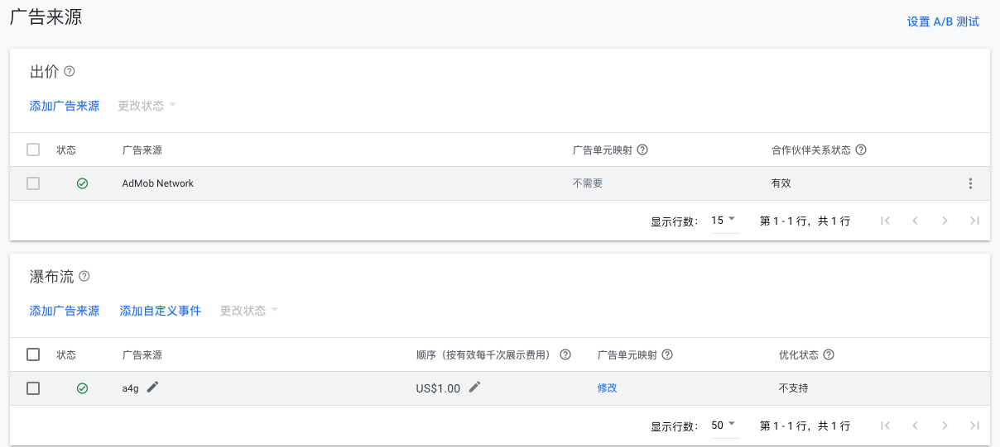
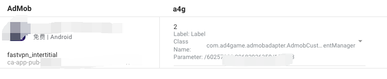

# admob-adapter

**Features**

 Banner
 Interstitial
 Rewarded
 
**Requirements**

Google Mobile Ads SDK 21.0.0 or higher
Use Android Studio 3.2 or higher
A minSdkVersion of 19 or higher
A compileSdkVersion of 28 or higher

**Installation**

Import adapter into your app/game
Add the following implementation dependency with the latest version of the adapter in the app-level build.gradle file:

repositories {
    maven {url "https://github.com/Ad4GameTech/admob-adapter/raw/main" }
}

// ...
dependencies {
    implementation fileTree(dir: 'libs', include: ['*.jar'])
    implementation 'com.google.android.gms:play-services-ads:21.4.0'
    **implementation 'com.Ad4game:admobmanager:1.0.7'**
}
// ...

**Usage**

**GDPR Compliance**

If you are not using any Consent Management Platform to handle privacy issues and managing user consent with your own solution, you have to inform admob mediation and mediation partners about the consent. The following code snippet is sample for gdpr consent usage for admob mediation. If you already have the snippet like below you need to add all these extras bundles for the reklamup custom event adapter as well.

```
AdRequest.Builder builder = new AdRequest.Builder();
Bundle extras = new Bundle();
extras.putString("npa", "1");
builder.addNetworkExtrasBundle(AdMobAdapter.class, extras);

// Add this for Reklamup
builder.addNetworkExtrasBundle(type.equals("banner") ? AdmobCustomEventBanner.class :
                type.equals("rewarded") ? AdmobCustomEventRewarded.class :
                        AdmobCustomEventInterstitial.class,
        extras);
```

**Configure mediation settings for your AdMob ad unit**
You need to add Ad4Game placements provided by the Ad4Game team to the mediation configuration as waterfall ad source for your ad unit.




Custom Event screen parameters
Class Name : You can use the following parameters depending on the ad unit format of the mediation group.

Interstitial : com.ad4game.admobadapter
Rewarded: com.ad4game.admobadapter
Banner : com.ad4game.admobadapter
Parameter : Ad4Game placement ids for each floor price provided by the Ad4Game team